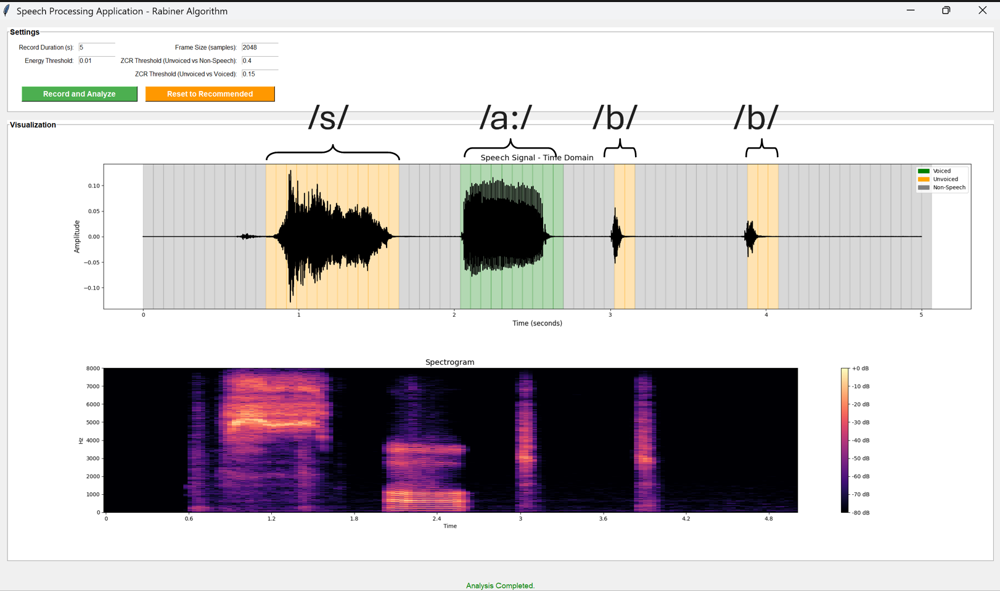

# Speech Frame Classification - Rabiner Algorithm (Tkinter GUI)

This project implements a **Speech Frame Classification** tool based on **Rabiner's algorithm** for identifying **voiced**, **unvoiced**, and **non-speech** segments in an audio recording.  
It features a **Tkinter GUI** to record audio live, analyze it, and visualize both the waveform and spectrogram, highlighting the classified regions.

---

## Features
- Record audio live from the microphone 🎙️
- Analyze audio frames using:
  - **Short-Term Energy**
  - **Zero-Crossing Rate (ZCR)**
- Classify frames into:
  - **Voiced**
  - **Unvoiced**
  - **Non-Speech**
- Visualize:
  - Time-domain waveform with color-coded segments
  - Spectrogram
- Adjustable settings for:
  - Record duration
  - Frame size
  - Energy threshold
  - ZCR thresholds for classification
- Threaded recording for responsive GUI
- Reset to recommended settings easily

---

## Screenshots



---

## How it works

### 1. Recording Audio
- The application records audio from the microphone for a user-defined duration.
- Audio is captured and stored in real-time.

### 2. Frame Analysis
- The recorded audio is divided into frames using a sliding window approach (typically with 50% overlap).
- For each frame:
  - **Short-Term Energy** is computed to measure the amplitude strength.
  - **Zero-Crossing Rate (ZCR)** is computed to assess the frequency of signal sign changes.

### 3. Classification Methodology

Once features (energy and ZCR) are extracted for each frame:

- **Energy Evaluation**:
  - Frames are categorized based on their energy compared to a set threshold.
  - Low-energy frames are candidates for **unvoiced speech** or **non-speech**.
  - High-energy frames are candidates for **voiced** or **unvoiced** speech.

- **Zero-Crossing Rate Analysis**:
  - For frames with **low energy**:
    - The ZCR is compared to a threshold to distinguish between **unvoiced speech** and **non-speech**.
      - High ZCR implies **unvoiced speech**.
      - Low ZCR implies **non-speech**.
  
  - For frames with **high energy**:
    - A separate ZCR threshold is used to differentiate **voiced speech** from **unvoiced speech**.
      - High ZCR indicates **unvoiced speech**.
      - Low ZCR indicates **voiced speech**.

- **Final Label Assignment**:
  - Based on this two-step decision-making (first using energy, then refining using ZCR), each frame is finally labeled as **voiced**, **unvoiced**, or **non-speech**.

### 4. Visualization
- The waveform of the audio is displayed.
- Each frame is color-coded based on its classification:
  - **Voiced**: one color
  - **Unvoiced**: another color
  - **Non-speech**: a third color
- A spectrogram of the entire audio is also plotted for frequency-time analysis.

---

## Requirements

Install the following Python libraries:

```bash
pip install numpy matplotlib sounddevice librosa
```

---

## Optional Enhancements
- Save recordings to disk.
- Save classification results.
- Fine-tune thresholds dynamically by visual feedback.
- Improve GUI design with more controls and visualization options.

---

## Acknowledgements
- Based on the classic method proposed by **Lawrence Rabiner** for speech signal classification.
- Thanks to open-source libraries like NumPy, Matplotlib, SoundDevice, and Librosa for making audio processing easy!

---
